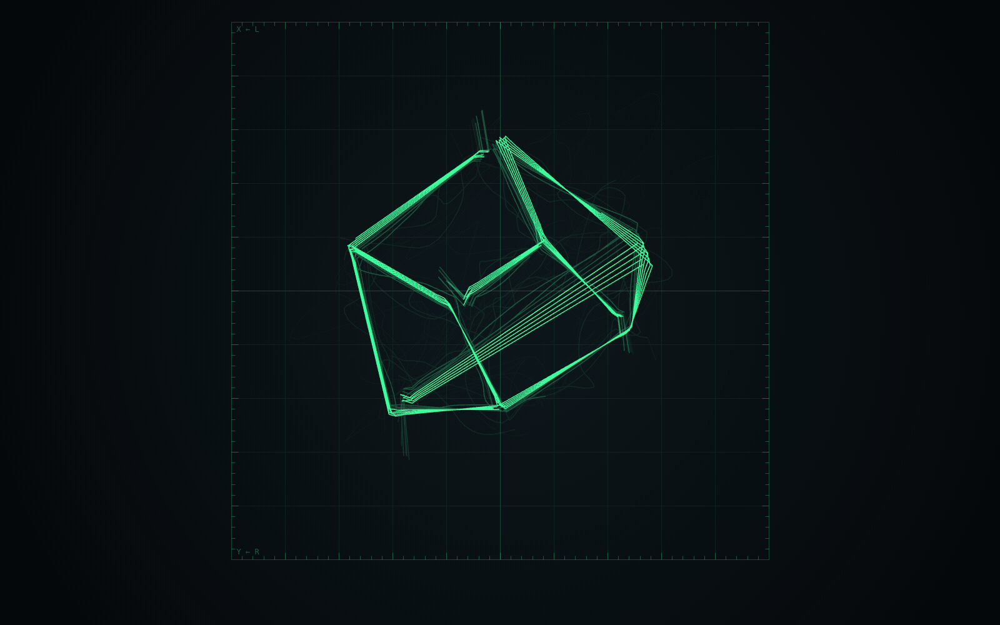
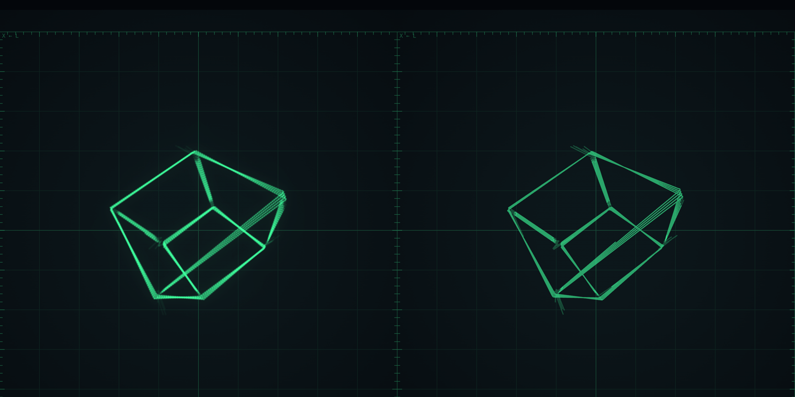
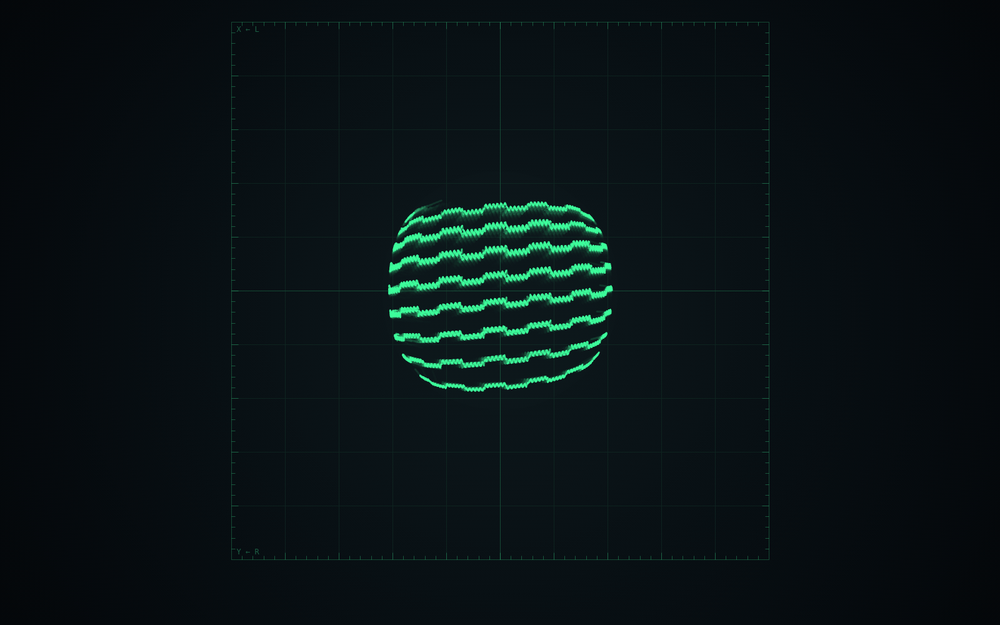
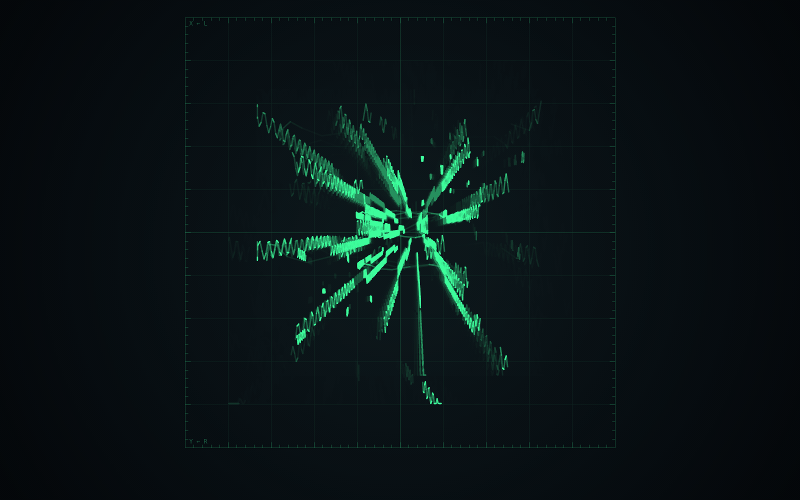
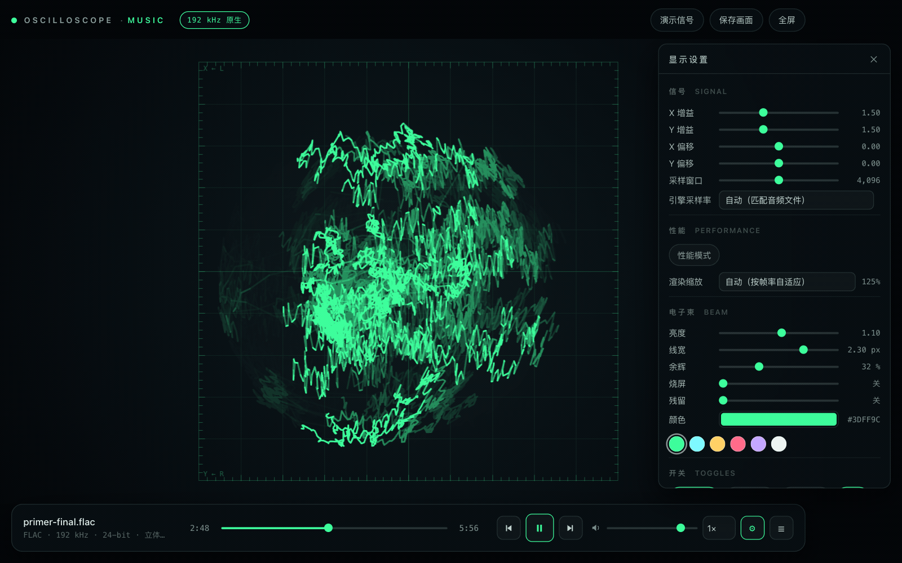

# 网页版示波器音乐播放 / 可视化器

左声道接 X，右声道接 Y，用电子束轨迹画利萨如图形和示波器音乐里的矢量画面。服务器版和单文件版共用同一批源码。



## 怎么画的

多数网页示波器每帧描一条线、每帧把整屏淡一点。这里把每个像素当作一块荧光粉：

```
E += 曝光 · Σ (1/束速) · 光斑        每帧加性沉积，束流打到哪就加到哪
E *= exp(-dt/τ)                      按真实经过的时间衰减
显示 = 颜色 · (1 - exp(-E/E₀))        饱和映射
```

三行各自换来什么，都能量：

- 亮度严格按 1/束速，没有分档。合成信号上剂量从匀速的 ×1.00 到静止束流的 ×20，所以一段亮一段不亮是按笔画出现的，不是按采样点。
- 浮点缓冲没有最小可表示值，也就没有量化地板。8 位路径靠 `destination-out` 的 `n ← n×(1-a)`，在 8 位下 `n ≤ 1/(2a)` 是死点：同样设置下它会永久留下占画面 13.98% 的残影，这边量到 0.02%。
- 饱和映射不是硬裁。最密段落过曝（alpha ≥ 250）占 0.01%，旧的 4096/62% 默认值是 12.8%。
- 衰减用 `performance.now()` 的真实差值，标签页被节流、机器卡一下都不会少衰减几帧。τ 由余辉换算（`τ = -dt/ln(1-a)`），所以同一个余辉百分比在两条路径上是同一件事。
- halation 云只在能量路径上有。它加在色调映射之后，作用在已经发出来的光上；加进能量缓冲会被推到饱和，渲染成一块边缘很硬的圆饼。8 位路径没有浮点缓冲，那一行在界面里是灰的。



*Oscillofun @22.5s，默认配方，光晕 55%，两边只有渲染器不同。左边那层包住图形的雾是 halation；右边笔画更硬，因为十级 alpha 阶梯到顶就没有余量了。*

没有 WebGL2，或者拿不到浮点渲染目标时，退回 Canvas 2D（`?renderer=2d` 可以强制）。两条路径跑同一套 159 项检查：渲染组整体跑两遍，再加一次 `--disable-webgl` 的强制回退。回退路径做不到的事在上面写明了。

启动时先在临时画布上画一段再读回来，确认真的画出了东西，才把真画布交给 WebGL。画布一辈子只发一种上下文，选错没有退路；有驱动会宣称支持浮点渲染目标却丢掉每一次绘制。

## 跑起来

| | 服务器版 | 单文件版 |
|---|---|---|
| 入口 | `server.js` + `public/` | `oscilloscope-standalone.html` |
| 启动 | `node server.js` | 双击打开 |
| 音频 | 自动列出项目目录，也支持拖拽和选择 | 拖拽或选择文件 |
| 适合 | 日常用、局域网共享、大文件流式播放 | 拷给别人、离线演示 |

零依赖，不需要 `npm install`。

```bash
node server.js --open      # http://127.0.0.1:10240
node server.js -p 8080     # 换端口；被占用会自动 +1 重试，也可以用环境变量 PORT
node test/verify.js        # 159 项端到端验证
node test/bench.js         # 性能基准
node build-standalone.js   # 改完 public/ 之后重新生成单文件版
```

## 参数按曲子调

描边型和填充型的要求相反，默认值取两者的中点。

| | 采样窗口 | 余辉 | 线宽 | 亮度 | |
|---|---|---|---|---|---|
| 默认 | 2048 | 24% | 1.75 | 0.9 | 取中点 |
| 描边型 `oscillofun.flac` | 1024 | 16% | 1.15 | 3.5 | 上面那张预览图 |
| 填充型 `primer-final.flac` | 4096 | 32% | 2.3 | 0.1 | 下面两张 |

亮度是曝光量，能量模型下每套配方得各给一个。细线的能量摊在更窄的面积上，密集图形又会不断重叠累加，同一个数字不可能同时合适。两条预设还各带一份 Canvas 路径专用的曝光，所以在没有 WebGL2 的机器上套同一套配方，观感也对得上。

这些数字不是随手写的。把窗口和余辉扫一遍，每格重新加载、播 9 秒，只统计绘图区里的覆盖率和过曝率：2048/24% 是 7.9% 覆盖、0.66% 过曝；2048/62% 涨到 16.4% 和 5.25%；4096 在任何余辉下过曝都不低于 1.5%，因为它一帧里线段自己就重叠了。覆盖率再高上去，笔画就分不出来了。

想要参考照片里那种虚线，把窗口和余辉压下去：

| | 采样窗口 | 余辉 | 亮度 | 覆盖率 | 亮暗比 p90/p50 |
|---|---|---|---|---|---|
| 默认 | 2048 | 24% | 0.9 | 11.6% | 2.1 |
| 虚线 | 512 | 0% | 0.45 | 2.3% | 3.1 |

同一段 Oscillofun @20s。2048 个采样在 44.1 kHz 下是 46 ms，音乐里的图形在这段时间里已经重复了好几遍，亮段和暗段叠在同一批像素上，平均下来就是一张亮网。窗口小了才看得见单根笔画自己的明暗。





判断方法只有一条：这首曲子是在画线，还是在画面。画线的压低余辉和小窗口，让束径露出来；画面的反过来，用窗口和余辉把面积堆实，线宽也要跟上。

回扫阈值同样按曲子调，默认 3×，范围 1–15×，半档步进。它跟速度消隐配套：比平均束速快过这个倍数就不画，只调暗没用，余辉累加几十帧照样会浮出来。冻结同一个窗口、拿 15× 当参照量过：10× 少画 4.0 / 5.3 / 0.4% 的亮像素（方块 / 穿梭 / 棋盘格），3× 少画 9.7 / 15.2 / 9.4%，多删的正是 3–10× 束速那一段，也就是素材自己最快的扫掠，所以穿梭段落最敏感，觉得哪首被削了就往上调。测试用一个合成信号量方块中心的像素，那里只可能来自那条快速斜穿的回扫线：关掉消隐 alpha 250，开启后 2。关掉速度消隐时这个滑块会置灰。

## 预设



面板顶部有三档内置配方：默认、描边、填充，参数就是上表里的。描边和填充的三项数字在代码里写全了，不从默认值继承，否则改一次默认值，预设就跟自己的文档对不上了。

两种模式。自动按曲记忆是默认的，切歌时套用这首歌上次的设置，改动随时记录；手动模式切歌不动设置，只有点预设才变。两种模式都记录每首歌的参数，中途换模式不会丢东西。

拖出满意的一套可以保存成自定义预设，双击改名，点 `×` 删，要按两下。存在浏览器本地，刷新和重开都在。导出是一段 JSON 文本，导入会校验：只认识的键、只接受滑块能表达的范围，名字撞车自动让步，不是 JSON 就原样不动。预设不带引擎采样率和渲染倍率，这两项描述的是机器，不是画面。

## 两个只在一条路径上有效的滑块

残留修的是 8 位路径的量化地板。余辉拉高会让残影更亮而不是留得更久，这个滑块控制定期擦除的力度。能量路径没有地板可擦，所以那一行在 WebGL 下置灰；测试也量了这件事，滑块拉到 100% 和 0%，结果必须一致。

光晕是 halation 云，只在能量路径上有。取样用三个尺度，其中粗的两级先做一次 13 点模糊再取，否则纹素格子会被放大，细笔画看着像一串小点。它是屏幕亮度的卷积，所以在密集图形周围明显，单根细线周围几乎看不见。光晕为 0 时整条路径一行代码都不跑。

## 卡顿和掉音

按 `⇧L`（或控制台 `__scope.perf()`，`__scope.perf(60)` 只看最近 60 秒）会打出帧日志：

```
帧日志:141.8s / 7859 帧
  中位 16.66 ms (60.0 fps) · p90 17.20 · p99 17.62 · p99.9 101.30 · 最差 4001.4 ms
  1% low 6.5 fps · 0.1% low 0.7 fps（其中 9 帧是隐藏标签页的 rAF 被拉长到整秒）
  去掉被拉长的帧后:中位 16.66 ms · p99 17.62 · 最差 17.7 ms
  超 20/33/50 ms 的帧:11 / 11 / 9
  最差的几帧:
    -238.0s  4001.4 ms (0.2 fps) · 4077 段 · 光晕开
  事件(负号 = 多少秒前):
    -0.4s  音频时钟落后 168 ms · 静默 1200 ms · readyState 4 · 缓冲 41.2s
    -239.5s 可见性 hidden
```

记的是帧间隔，不是帧内的工作时间。最差的那几帧会带上当时的线段数、光晕开关、是否刚 resize，所以能分清是自己的渲染还是合成器或系统。

音频那条线里，`音频时钟落后` 是查掉音的关键。音频线程错过截止时间不会触发任何 DOM 事件，元素仍然说自己在播，没有 waiting 也没有 error。会动的只有音频时钟：`AudioContext.currentTime` 只在整个音频图真的在渲染时才前进，所以墙上时间减去音频时钟就是掉音的毫秒数。同一行还带着 readyState 和缓冲余量。其余会记的：音频上下文状态变化、信号静默（在播放但分析器全是 0）、Firefox 的长任务条目、页面 freeze 和可见性变化。媒体事件（playing / pause / waiting / stalled / error）也在同一条时间线上。

窗口是最近 8192 帧，约两分半。

## 控制台接口

| | |
|---|---|
| `__scope.state` | 渲染器、画布尺寸、绘图区、工作耗时、采样率、剂量峰值、光晕 |
| `__scope.perf(n)` | 帧日志文本，n 为最近多少秒 |
| `__scope.readTrace(x,y,w,h)` | 画面某一块的 RGBA 字节 |
| `__scope.readAnalyser()` | 当前窗口两个声道的原始采样 |
| `__scope.setRateMode('device'\|'auto')` | 切换采样率策略 |

URL 参数：`?renderer=2d` 强制 Canvas 回退，`?demo=1` 内置合成信号，`?track=N` 直接载入第 N 首，`?play=1` 载入后自动播放。测试的渲染阶段就是靠这几个跑起来的。

键盘：空格播放暂停，方向键后退前进和音量，`,` `.` 换曲，`D` 演示信号，`F` 全屏，`S` 存图，`L` 播放列表，`P` 设置面板，`⇧L` 帧日志，`B` 速度消隐，`T` 相位锁定，`G` 网格，`O` 性能模式，`R` 恢复默认，`Esc` 关面板。

坐标约定是 X 接左声道、Y 接右声道、正方向朝上。曲子是按某个手性做的，参考机器也可能把 Y 反接，所以开关组里有 X 反向和 Y 反向，翻转时增益读数带负号。这两个开关跟着每首歌的参数一起记录。

余辉的累积跨曲目保留，窗口缩放和全屏切换后也按比例保留。重设 `canvas.width` 会清空位图，所以要手动搬过去，否则改一下窗口大小残影就没了。

## 目录

```
server.js                       零依赖服务器：静态文件、播放列表 API、Range 流式传输
probe.js                        音频头解析：采样率、位深、声道、时长，不解码音频帧
public/js/core.js               工具函数、设置对象、DOM 引用、toast
public/js/audio.js              音频图、分析器、演示信号、采样率策略
public/js/shaders.js            GLSL 源码
public/js/gl.js                 能量渲染器：浮点累积、色调映射、halation
public/js/perf.js               帧间隔环、工作耗时环、掉音看门狗
public/js/trace.js              采样到像素、1/束速剂量、两条累积路径
public/js/render.js             几何、刻度、帧循环、画质调节、对外接口
public/js/apply.js              设置对象与控件、引擎、画面之间的桥
public/js/presets.js            预设、按曲记忆、导入导出
public/js/playlist.js           曲目列表、文件选择、播放控制
public/js/ui.js                 控件、键盘、面板、拖放
public/js/main.js               接线与 init
build-standalone.js             把同一批源码内联成单文件
test/verify.js                  测试入口：分配端口、起服务器、按顺序跑各段
test/harness.js                 断言与计数、HTTP 客户端、起服务器、找浏览器
test/sections/*.js              159 项按失败方式分段：port、http、render-*、presets、resample、standalone
test/bench.js                   性能基准
```

服务器和测试也按失败方式拆：`server.js` 管路由、Range 和启动，音频头解析在 `probe.js`（写错是播放列表里的数字不对）；`verify.js` 只当入口，每一项检查在 `test/sections/` 里，渲染段是一个浏览器会话加一串场景（消隐、光晕、坐标、剖面、实时音频、累积层、主题）。

模块是单向依赖的：core → audio / shaders → gl / perf / trace → render → apply → presets → playlist → ui → main。拆分的依据是失败方式：GLSL 写错是驱动报编译错，perf 写错是日志里的数字不对，trace 写错是画面不对，三种查法混在一个文件里没法用。模块之间只通过命名空间调用或者顶部解构出来的别名引用，没有跨模块的裸变量。

服务器版按原生 ES 模块加载，单文件版由 `build-standalone.js` 内联。内联器只认一种很小的方言（`import * as ns from './x.js'`，`export function/const/{...}`），其他写法都报错退出：`export default`、`export let`、具名 import、动态 `import()`、import 环、指向不存在导出的别名。`export let` 在真 ESM 里是活绑定，内联后会变成快照，与其编错不如编不过。

音频文件不进版本库，两个测试文件合计约 300 MB。把音频丢进项目根目录，服务器会自动扫到。

## 已知问题

- 单文件版在 `file://` 下不能自动列目录，浏览器安全限制，拖进去或者点选择文件。
- FLAC 放不了是浏览器缺解码器，先转 WAV。
- ALAC、AIFF、AIFF-C、CAF 在 Chrome / Chromium 里放不了。这几个浏览器没有对应解码器，`canPlayType` 返回空字符串，元素报 `MediaError 4`；Safari 都能放。界面会直接说清是哪种格式。
- 采样率从文件头读，不靠解码。覆盖 WAV、FLAC、m4a（AAC / ALAC）、AIFF / AIFF-C / CAF、Ogg（Vorbis / Opus）、MP3。几处细节：m4a 的 `moov` 常在文件末尾（ffmpeg 默认把 `mdat` 写在前），要补读尾部，而 ALAC 的真值在 36 字节的 codec box 里，因为通用 sample entry 的采样率是 16.16 定点，装不下 65535 Hz 以上；AIFF 的采样率是 80 位 IEEE 扩展浮点；Ogg 的时长是最后一页的 granule position，也要读尾部，Opus 一律报 48 kHz，它解码出来就是 48 kHz；MP3 只报采样率和声道。
- 裸 `.aac`（ADTS）和 `.webm` / `.weba`（EBML）没解析，会退回设备采样率，也就是会被重采样。已知缺口。
- 270 MB 的 FLAC 不会卡：走 audio 元素流式解码加服务器 Range，不整文件进内存；`decodeAudioData` 才会吃掉上 GB。
- 余辉拉到 0 会闪，每帧全清只画一个片段；40% 以上才累积得出完整画面。

## 许可

[Apache License 2.0](LICENSE) · Copyright 2026 CHT-1192
